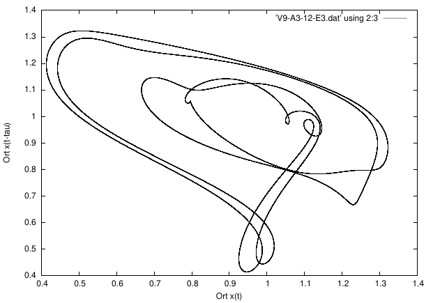
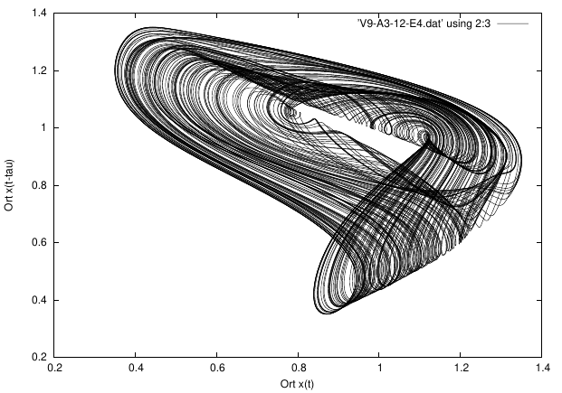
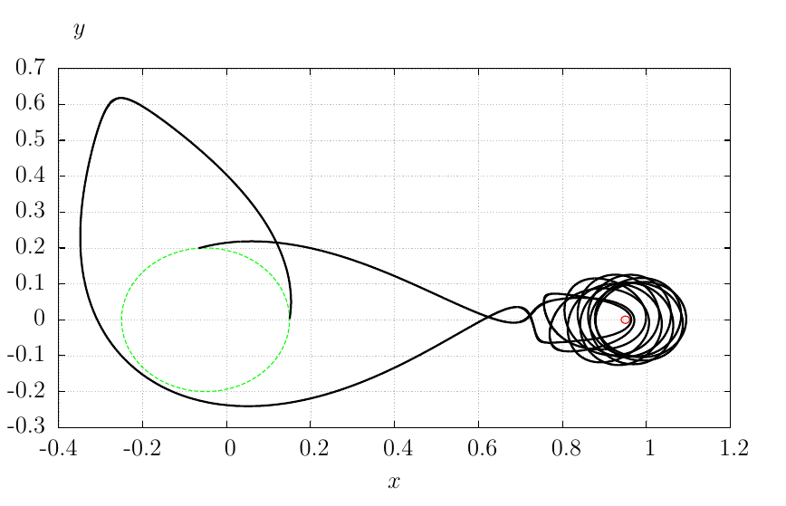
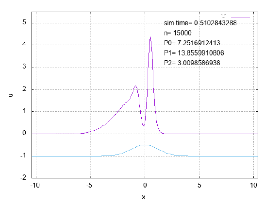

# Hi there 👋 &#x1DF0B;

> Ad Astra per Aspera

## Physics

### General Relativity

I wrote my master thesis about general relativity. How we can deal with higher derivative terms in the action integral and in the following equations of motion? A mathematical solution was found, but no physical explanation for that.

     
     

For more information see me [repository](https://github.com/christiang7/Master_thesis_aspects_of_field_theories_in_higher_derivative_terms). 

### Computational Physics

#### Mackey-Glass-equation solutions

      

    
For more see the [nonlinear computational physics repository](https://github.com/christiang7/Nonlinear-computational-physics) 

#### 3 body problem orbits

      

    
For more see the [3 body problem simulation repository](https://github.com/christiang7/Comp-Physics-1-3-body-problem) 

#### Falling liquids - Korteweg de Vries solutions

      

    
For more see the [falling liquids simulation repository](https://github.com/christiang7/Comp-Physics-4-Falling-liquid-films) 

<!--
**christiang7/christiang7** is a ✨ _special_ ✨ repository because its `README.md` (this file) appears on your GitHub profile.

Here are some ideas to get you started:

- 🔭 I’m currently working on ...
- 🌱 I’m currently learning ...
- 👯 I’m looking to collaborate on ...
- 🤔 I’m looking for help with ...
- 💬 Ask me about ...
- 📫 How to reach me: ...
- 😄 Pronouns: ...
- ⚡ Fun fact: ...
## 🏆 GitHub Trophies

### ✍️ Random Dev Quote

# 📊 GitHub Stats:
 
 

-->

## 🌐 Socials:
  

## 💻 Tech Stack:
         

---

<!-- Proudly created with GPRM ( https://gprm.itsvg.in ) -->